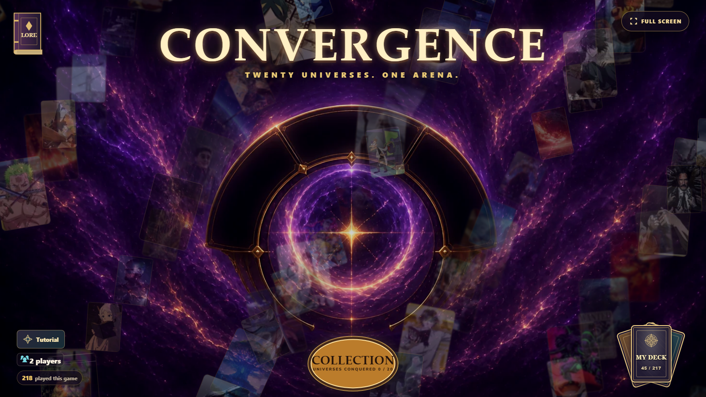

# Convergence

**Twenty universes. One arena.**

Build a deck. Challenge a champion. Bring their world into yours.

**[Play in your browser](https://ross-ai-lab.github.io/convergence-card-game/play/)** · [Explore the lore](https://ross-ai-lab.github.io/convergence-card-game/materials/Convergence-Official-Lore.html) · [Card statistics](materials/Convergence%20card%20stat%20excel%20sheet.xlsx)

Convergence is a free browser card duel with 172 named character cards, 11 Basic cards and 34 relics.
It uses separate 30-card decks and a deterministic rules engine. Play directly in the browser, without an account or installation.

<!-- README-NAV-START -->
- [Choose your arena](#choose-your-arena)
- [Start playing](#start-playing)
  - [Controls](#controls)
- [Rules at a glance](#rules-at-a-glance)
- [Win and collect](#win-and-collect)
  - [Progress stays in this browser](#progress-stays-in-this-browser)
- [Explore and contribute](#explore-and-contribute)
<!-- README-NAV-END -->

## Choose your arena

| Mode | What you play |
|---|---|
| Collection campaign | Challenge twenty champions. Every universe is available from the start. |
| My Deck | Build a thirty-card deck from your collection and choose a Hero Power. |
| Two-player hotseat | Share one device with separate decks and private hands. |
| Free duels | Finish the campaign to unlock Recruit, Veteran and Ascendant opponents. |
| Tutorial | Learn card play, attacks, targeting, relics and Hero Powers in a short guided duel. |

<strong>See the card collection</strong>

## Start playing

1. Open the game and try **Tutorial**. It finishes automatically after the final lesson.
2. Open **My Deck**. You begin with forty-five available cards and a ready thirty-card starter deck.
3. Select **Collection**, choose a universe and challenge its champion.
4. Win new cards, earn Hero Powers and build the deck you want to play.

**Mend Core** is available and equipped from the start. Your first champion victory also unlocks **The Empty Chair**, a six-panel comic in the Lore book. Nine further chapters remain sealed.

### Controls

| Action | Mouse and keyboard | Touch |
|---|---|---|
| Play a card | Click its card and destination, or drag it | Tap the card, then a highlighted slot or bearer |
| Attack | Click an attacker and target, or drag | Tap both |
| Read a card | Hover the hand, board or deck list | Inspect a card in My Deck; hold a collection card to open its profile |
| Inspect a relic | Hover or hold its attached badge | Tap for a brief preview; hold to keep it open |
| End your turn | **End Turn**, Space or Enter | **End Turn** |
| Cancel a choice | Escape | Tap the selection again or the board background |

In My Deck, click a keyword for its explanation or a token name for its enlarged card.
Locked cards keep their printed rules visible and identify the champion needed to unlock them.
Cards sort by mana, lowest first; choosing a mana value sorts that result by rarity instead.

Phone battles use landscape orientation. Menus and deck editing also work upright. Swipe the hand to reach later cards.
Rules, sound controls and duel history are available during a duel. Use **Menu** on phones.

Minions belong to Magic, Nature, Tech or ALL, and have Good, Evil or Neutral alignment.
Relics are teal equipment cards carried by minions. The in-game **How to play** guide contains the full effect glossary.

## Rules at a glance

- Both cores begin at **30 health**. Reduce the opposing core to zero to win.
- Each player draws from their own shuffled **30-card deck** and opens with **3 cards**. Solo play offers one opening mulligan; hotseat offers one private mulligan per player. The second hotseat player receives **The Coin**.
- At the start of a turn, draw one card. Mana begins at **1**, refills each turn, and increases by one up to **10**.
- Your hand holds at most **10 cards**. A card drawn into a full hand burns.
- Pay a card's mana cost to play it. Each player has **four board slots**. Summons need an available slot.
- A newly played minion normally sleeps until its owner's next turn. **Charge** allows an immediate attack.
- A ready minion attacks once per turn. Combat damage is simultaneous: defenders hit back even when the attack destroys them.
- **Taunt** prevents attacks on the opposing core until its defence is removed, unless an effect explicitly bypasses it.
- **Chained** minions lose two of their own turns. They cannot attack, activate Passive or Ongoing effects, or be targeted while chained.
- **Freeze** costs one attack turn. A frozen minion remains targetable and keeps its Passive effects.
- **Silence** disables printed abilities and keywords, removes positive stat buffs, and retains stat reductions. It never heals a damaged minion.
- Each minion can carry up to **two relics**. Returning it to hand discards its attached relics; its death destroys them unless their text says otherwise.
- Earned player Hero Powers cost **2 mana** and can be used once per turn. Boss powers have their own printed costs or passive rules.
- When your own draw pile and bottom pile are empty, attempts to draw cause escalating fatigue damage: **1, 2, 3**, and so on.

## Win and collect

**Total: 45 initial cards + 172 rewards = all 217 cards.**

The first victory in each universe grants its fixed reward once. Replays do not grant duplicate packs.
Defeat, surrender, a draw or an abandoned attempt grants no reward. New cards never silently replace cards in your deck.
Nine first victories unlock the remaining Hero Powers. Universe order does not matter.
A new power makes its chooser glow until you open and close it.

Human turns last **100 seconds**. A warning appears only during the final **fifteen seconds**.
Unfinished cancellable plays return to hand when time expires; committed choices finish before the turn passes.
Training and developer test duels have no deadline.

Each champion has a named power and voiced dialogue. The text remains readable when audio is unavailable.
Victory dialogue and unclaimed rewards survive a reload.

### Progress stays in this browser

Your collection, decks and ongoing duel save on this device in this browser.
A private window or cleared browser storage starts a separate collection. **Continue duel** restores an unfinished game.
There is no online multiplayer or account synchronization. The website displays an aggregate visit count.

## Explore and contribute

| Page | What you will find |
|---|---|
| [Character lore](https://ross-ai-lab.github.io/convergence-card-game/materials/Convergence-Official-Lore.html) | Character profiles and Star Charts |
| [Card statistics](materials/Convergence%20card%20stat%20excel%20sheet.xlsx) | The current roster, relics and rules |
| [CONTRIBUTING.md](CONTRIBUTING.md) | Reporting problems, development, focused checks and publishing |
| [DESIGN-DECISIONS.md](DESIGN-DECISIONS.md) | Why the game and its systems work this way |
| [AGENTS.md](AGENTS.md) | Project guidance and task entry points for AI agents |

Useful feedback includes the card names, what happened, what you expected, and a screenshot when the issue is visual.
See [contributing](CONTRIBUTING.md#reporting-a-problem) for the details that make a problem reproducible.

The [WebP artwork collection](source/public/card-art/raw/) is the maintained image library.
Optional [audio tracks](https://github.com/Ross-ai-lab/convergence-card-game/releases/download/v1.0/Convergence-Audio-Tracks.7z) and [rendered card-production material](https://github.com/Ross-ai-lab/convergence-card-game/releases/download/v1.0/Convergence-Card-Production.7z) are available separately.
