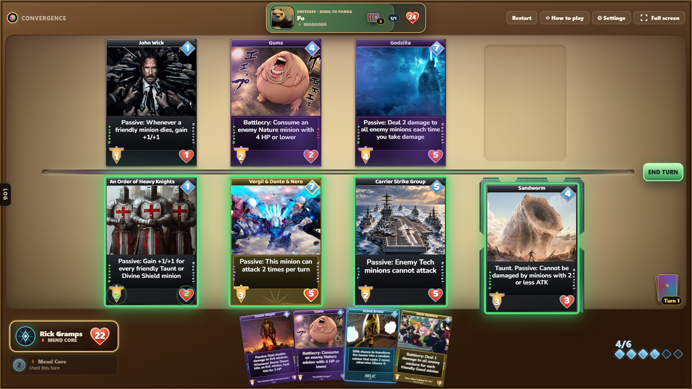
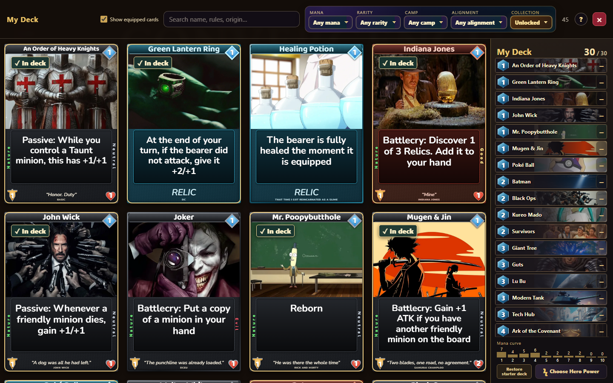
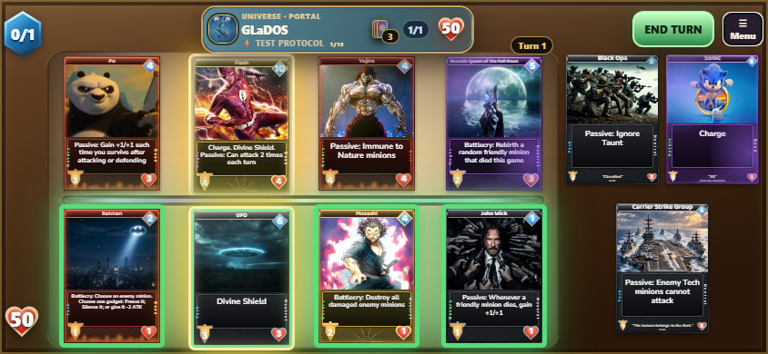
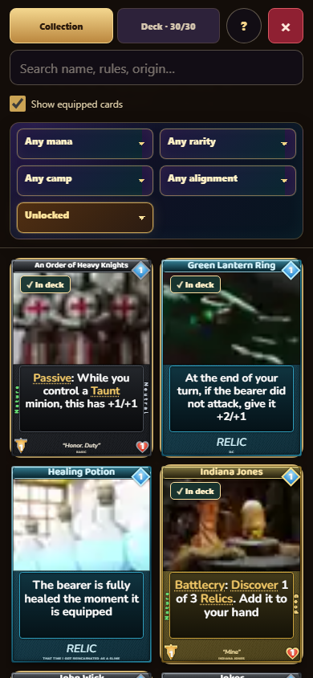

# Convergence

A browser card duel where fighters from twenty universes meet in one arena.
Build a deck, challenge their champions, and collect their cards.

**[Play the game](https://ross-ai-lab.github.io/convergence-card-game/play/)** ·
[Project website](https://ross-ai-lab.github.io/convergence-card-game/) ·
[Card statistics](materials/Convergence%20card%20stat%20excel%20sheet.xlsx) ·
[Character lore](https://ross-ai-lab.github.io/convergence-card-game/materials/Convergence-Official-Lore.html)

Convergence is a free fan-made game with 172 named character cards, 11 Basic cards and 34 relics.
It uses separate 30-card decks, four board slots per player, and a deterministic rules engine.
There is no account, download, or installation needed to play.

<p>
  
  
  
  
</p>

<!-- README-NAV-START -->
- [What you can play](#what-you-can-play)
- [Rules at a glance](#rules-at-a-glance)
- [Controls](#controls)
- [Cards and effects](#cards-and-effects)
- [Campaign and progression](#campaign-and-progression)
  - [Character voices](#character-voices)
- [Project structure](#project-structure)
- [Development](#development)
  - [Generated statistics workbook](#generated-statistics-workbook)
  - [Documentation navigation](#documentation-navigation)
- [Publishing](#publishing)
- [Contributor reference](#contributor-reference)
  - [Changing cards](#changing-cards)
  - [Engine invariants](#engine-invariants)
  - [Interface, art, and audio](#interface-art-and-audio)
  - [Developer tools](#developer-tools)
- [Included materials](#included-materials)
<!-- README-NAV-END -->

## What you can play

- **Collection campaign:** challenge any of twenty champions, from GLaDOS to Saitama. Each first victory unlocks that universe's cards.
- **My Deck:** start with forty-five available cards, build a thirty-card deck, and choose an earned Hero Power. Rewards expand your collection; you decide which cards enter your deck.
- **Two-player hotseat:** share one device using separate decks. An opaque privacy screen hides hands between turns.
- **Free duels:** completing the campaign opens Recruit, Veteran, and Ascendant opponents with random thirty-card decks.

The game supports desktop, landscape phone duels, and tablet layouts.
Phone duels require the device to be held sideways. The game requests fullscreen and landscape rotation when supported by the browser.
If automatic rotation is unavailable, a rotate screen waits until the phone is turned sideways. Menus and deck editing also work upright.
All four slots on both boards stay visible. The hand scrolls independently.
The phone deck editor has Collection and Deck tabs in its top row and a two-column collection grid.
Search and filters remain available and scroll with the collection. Hold a collection card for one second to open its full profile.
On desktop, hovering a deck-list row immediately shows the complete card. A checked In deck badge identifies selected collection cards.
Choose Hero Power sits beside Restore starter deck. A newly earned power makes it glow until the chooser is opened and closed. Restoring requires confirmation on every platform.
The Lore book holds ten chapters. A first victory against any champion opens **The Empty Chair**, a six-panel comic. Chapters II–X remain sealed.
The title screen offers Tutorial beside two-player play. Its guided duel covers card play, turns, attacks, targeting, equipment, and Hero Powers, then ends automatically.

Progress and ongoing duels save in this browser on this device. A private window or cleared browser storage starts a separate collection.
There is no online multiplayer or account synchronization. The public website displays an aggregate visit count.

## Rules at a glance

- Both cores begin at **30 health**. Reduce the opposing core to zero to win.
- Each player draws from their own shuffled **30-card deck** and opens with **3 cards**. Solo play offers one opening mulligan; hotseat offers one private mulligan per player. The second hotseat player receives **The Coin**.
- At the start of a turn, draw one card. Mana begins at **1**, refills each turn, and increases by one up to **10**.
- Your hand holds at most **10 cards**. A card drawn into a full hand burns.
- Pay a card's mana cost to play it. Each player has **four board slots**. Summons need an available slot.
- A newly played minion normally sleeps until its owner's next turn. **Charge** allows an immediate attack.
- A ready minion attacks once per turn. Combat damage is simultaneous: defenders hit back even when the attack destroys them.
- **Taunt** prevents attacks on the opposing core until its defence is removed, unless an effect explicitly bypasses it.
- **Chained** minions lose two of their own turns. They cannot attack, activate Passive or Ongoing effects, or be targeted while chained.
- **Freeze** costs one attack turn. A frozen minion remains targetable and keeps its Passive effects.
- **Silence** disables printed abilities and keywords, removes positive stat buffs, and retains stat reductions. It never heals a damaged minion.
- Each minion can carry up to **two relics**. Returning it to hand discards its attached relics; its death destroys them unless their text says otherwise.
- Earned player Hero Powers cost **2 mana** and can be used once per turn. Boss powers have their own printed costs or passive rules.
- When your own draw pile and bottom pile are empty, attempts to draw cause escalating fatigue damage: **1, 2, 3**, and so on.

## Controls

| Action | Phone or tablet | Mouse and keyboard |
|---|---|---|
| Play a card | Tap the hand card, then a highlighted slot or bearer | Click the card and its destination, or drag it |
| Attack | Tap a ready minion, then a highlighted enemy or core | Click both, or drag the attacker |
| Read a hand or board card | Read its printed rules on the card | Hover a board minion; hover the hand to enlarge it |
| Read a character profile | Hold a collection card for one second in My Deck | Click its name in My Deck |
| Inspect equipped relics | Tap the badge for a one-second preview, or hold it until finished | Hover the badge, or click and hold it |
| End the turn | Tap **End Turn** | Click **End Turn**, or press **Space** / **Enter** |
| Clear a choice | Tap the selected card again or the board background | Press **Escape** |
| Rules, sound, and restart | Open **Menu** during the duel | Use the duel toolbar |
| Duel history | **Menu → Duel log** | Open the **Log** drawer |

Swipe the phone hand to reach later cards. Swiping does not start a card drag.
Hand, board, opening-hand, and collection cards show their printed descriptions at every size.
Undo is a developer-only tool. Normal duels expose neither an Undo menu option nor the Z shortcut.
Double-tap the opening ceremony to skip its animation; the opening hand is already determined.
The title screen's **Continue duel** restores an unfinished game.
Opening-hand choices fit the screen without scrolling and retain their printed descriptions.
Phone mana and health counters sit in the left corners, leaving the side hand available from top to bottom.
Landscape phone layouts devote more height to the board and show larger hand cards. Discover choices fit all three complete cards and their printed rules without scrolling.
Solo games call your character Rick Gramps. Two-player duels retain Player One and Player Two.

## Cards and effects

Minions have mana cost, attack, health, rarity, camp, alignment, artwork, and rules text.
The camps are **Magic**, **Nature**, **Tech**, and **ALL**. ALL counts as every camp for camp-based buffs and target selection.
Damage-immunity rules still use the attacker's actual camp.
Alignments are **Good**, **Evil**, and **Neutral**.

| Timing | When it acts |
|---|---|
| Battlecry | Once on arrival |
| Ongoing | At the start of its owner's turns, while active |
| Passive | Continuously, while active |
| Battlecry/Ongoing | On arrival and at the start of its owner's turns |
| Deathrattle | After death, unless silenced |

**Divine Shield** blocks one damage instance. **Invulnerable** prevents damage while its condition holds.
**Reborn** returns a minion to its slot at one health, with printed attack and no buffs or relics. It is a keyword, not a Deathrattle.
The printed number of rebirths controls its remaining lives; Silence prevents it.
**Evade** is the player-facing name for avoiding an attack. Older internal identifiers may use `dodge`.

The in-game How to play guide contains the full glossary.
[keywords.ts](source/src/keywords.ts) supplies both that glossary and card keyword explanations.
Repeated concepts become keywords; one-off mechanics remain ordinary card text.

Relics are equipment cards drawn from the same deck as minions.
They use a teal frame and print **RELIC** in the flavour position, with no camp or alignment rails.
Their attached badges show the bearer. Tap or hold a badge to inspect the equipped relic's complete card.

## Campaign and progression

Every universe is selectable from the start. Defeat, surrender, a draw, or an abandoned attempt grants no reward.
Each first victory grants its fixed reward once. Replaying a conquered universe grants no duplicate pack.
Rewards never silently rebuild the player's deck.

**Total: 45 initial cards + 172 rewards = all 217 cards.**

Mend Core is available and equipped from the start. Nine first victories unlock the remaining Hero Powers. Universe order does not matter.
Human turns last 100 seconds. Only the final fifteen seconds show a countdown. Unfinished cancellable plays return to hand when time expires.
Committed choices resolve before the turn passes. Training and developer test duels have no deadline.
Each campaign boss has its own named power. The boss portrait identifies the opponent; it does not place a free minion on the board.
All modes retain the ordinary core health, opening hand, mana progression, and four-slot board.

| Universes | Difficulty profile |
|---|---|
| 1–4 | Recruit |
| 5–10 | Veteran |
| 11–14 | Ascendant search with cheats disabled |
| 15–20 | Full Ascendant, including reply-reading, true-dice knowledge, Clairvoyance, and Foresight |

[campaign-design.json](materials/campaign-design.json) is the authority for bosses, deck lists, rewards, and difficulty.
[campaign-story.json](materials/campaign-story.json) supplies Rick Gramps's prologue and each champion's introduction, victory, loss, and collected-play speech.
The written dialogue remains usable if audio fails. **Show full text** reveals a speech; its forward button then advances it.
Unacknowledged victory dialogue and reward packs survive a reload.

### Character voices

Character dialogue was generated with **Qwen3-TTS**.
The project uses **Qwen3-TTS-12Hz-1.7B-VoiceDesign** to cast character voices and **Qwen3-TTS-12Hz-1.7B-Base** to reuse selected reference voices consistently.
The game ships 101 campaign recordings: Rick Gramps's prologue, twenty Rick introductions, and eighty champion dialogue lines.
The [voice cast](materials/campaign-voice-cast.json) and [recording manifest](source/data/campaign-voices.json) preserve the dialogue, recording fingerprints, and audio checksums.
Voice models and generation environments are not required to play.

## Project structure

| Path | Purpose |
|---|---|
| [source/](source/) | React, TypeScript, Vite, and the test tools |
| [source/data/cards.csv](source/data/cards.csv) | Live minion definitions |
| [source/data/relics.csv](source/data/relics.csv) | Live relic definitions |
| [source/src/engine/](source/src/engine/) | Deterministic game rules and bot search |
| [source/src/App.tsx](source/src/App.tsx) | Duel interface and deck editor |
| [source/src/screens/](source/src/screens/) | Title, campaign, dialogue, rules, and settings |
| [source/src/mobile.css](source/src/mobile.css) | Phone and tablet layout, loaded after desktop styles |
| [source/src/phone-layout.ts](source/src/phone-layout.ts) | Phone detection, fullscreen request, and landscape rotation |
| [source/src/relic-peek.ts](source/src/relic-peek.ts) | Tap and hold timing for equipped relic card previews |
| [source/src/gallery-detail.css](source/src/gallery-detail.css) | Character profiles and Star Charts |
| [source/public/](source/public/) | Runtime artwork, fonts, and audio |
| [source/scripts/](source/scripts/) | Validation, browser checks, production build, and publishing |
| [materials/](materials/) | Lore, campaign data, statistics, raw art, and optional production tools |
| [play/](play/) | Generated playable release; build it from source |
| [counter/](counter/) | Aggregate website visit-count service |
| [index.html](index.html) and [styles.css](styles.css) | Public project landing page |

Card definitions, campaign JSON, and engine code are authoritative. The statistics workbook and playable release are generated outputs.
README.md is the project's sole maintained documentation page.

## Development

Use Node.js **22.12 or newer**, or a supported newer release, and npm.
Run these commands from `source/`:

```sh
npm ci
npm run dev
```

The development address is **http://localhost:5177**. The port is fixed; an occupied port produces an error.
Use the server address rather than opening the game through `file://`.
The first run prepares the lore module and checks the card workbook.

```sh
npm run check             # selects the relevant suites from changed files
npm run check -- --all    # all ordinary verification suites
npm run build            # TypeScript check and production build
```

The check runner executes unit tests before browser suites to avoid timing failures under CPU load.
Browser suites use this project's Playwright Chromium and need the development server running.
Install its browser once with `npx playwright install chromium` on a new development machine.
For Safari engine checks, install Playwright WebKit and run `node scripts/check-mobile.mjs --webkit`.
That pass covers upright menus, phone rotation, landscape duels, and tablet layouts with touchscreen taps.
Chromium checks native holds and swipes. WebKit checks long-press pointer events and scroll containers programmatically.

| Focused command | Checks |
|---|---|
| `npm test` | Engine, saves, decks, progression, targeting, and bot legality |
| `npm run validate:data` | Card definitions, public roster counts, and workbook freshness |
| `npm run check:ui` | Duel controls and title-screen behaviour |
| `npm run check:cardface` | Card names, text fit, stats, and viewport containment |
| `npm run check:features` | Tutorial, developer tools, and all character profiles |
| `npm run check -- --only mobile` | Phone/tablet layouts, touch interactions, reader, deck editing, and landscape |
| `npm run check:audio` | Music and effects routing |
| `npm run check:campaign-voices` | Campaign recordings, cast manifest, and checksums |
| `npm run check:coverage` | A behaviour test for every printed nontrivial card effect |

`npm run check` also covers campaign progression, performance, relic popups, and the card workbook.
Balance simulations are separate and do not run implicitly.
When completing work, run only checks you judge necessary for the actual changes. Do not run all suites by default.
Use focused unit tests and relevant browser checks; skip unrelated phone/tablet matrices and simulations.
Run the full suite only when the change genuinely needs it or the owner requests it.
Inspect real populated screens at their intended sizes; geometry assertions complement visual review.

### Generated statistics workbook

[Convergence card stat excel sheet.xlsx](materials/Convergence%20card%20stat%20excel%20sheet.xlsx) contains Cards, Relics, Rules, and Summary tabs.
It is generated from the two CSV rosters, rarity definitions, and this page's Rules at a glance.
The adjacent `.sync.json` record verifies both the source fingerprint and workbook bytes.

`npm run sync:cards` refreshes it when sources change. Development watches those sources; builds and deployment check freshness.
Regeneration requires the bundled Codex spreadsheet runtime. Set `CONVERGENCE_ARTIFACT_RUNTIME` to its dependency directory when needed.
An unchanged workbook can be verified with Node alone. The generator refuses a missing runtime or a workbook locked in Excel.
`node scripts/check-card-workbook.mjs --exercise` tests generation using disposable data, independently checks the XLSX, and removes its temporary files.

### Documentation navigation

`npm run readme:index` refreshes this page's contents from its headings.
`node scripts/readme-index.mjs --check` verifies that the generated navigation is current.
`npm run validate:docs` keeps maintained Markdown documentation in this README.

## Publishing

The public game lives at **https://ross-ai-lab.github.io/convergence-card-game/play/**.
The landing page lives one directory above it.

From `source/`:

```sh
npm run publish:pages
```

This validates the data and workbook, builds the source, replaces `play/`, compares every generated file by hash, and rejects a leaked development hook.
It prepares the release files locally. Publication happens when the updated source, documentation, landing page, workbook, and generated `play/` reach the repository's main line.
[pages.yml](.github/workflows/pages.yml) then deploys them to GitHub Pages and independently checks workbook freshness.

Wait for the deployment to succeed. Verify the live `/play/` page, deployed bundle names, artwork, dialogue, and an actual duel.
Do not report deployment from a successful build alone.
Vite uses relative asset paths so the release works under the repository's `/play/` directory.
Runtime art and audio addresses must use [asset-url.ts](source/src/engine/asset-url.ts) or the configured base; hardcoded root paths can work locally and fail on Pages.

## Contributor reference

### Changing cards

1. Edit the appropriate CSV in `source/data/`; do not maintain a second roster.
2. Keep effect text consistent with the engine. Specific effects ask the player to choose; explicitly random, positional, weakest, or costliest effects resolve automatically.
3. Add or update the behaviour test. Every nontrivial new card needs a test reached by `check:coverage`.
4. Run `validate:data`, unit tests, and the applicable browser checks. Rebuild the workbook and playable release.
5. Name the affected cards in the change description. `npm run changed-cards` and `npm run card-history -- "Card name"` help trace changes.

Effect text has no final period, comma, semicolon, or colon. Internal sentences retain punctuation.
Use the existing wording for repeated mechanics, such as Freeze, Silence, Chained, and Reborn.
Every new vocabulary value belongs in [types.ts](source/src/engine/types.ts); validators derive their lists from it.

Mana is the subject's lore power tier. Assign it from canon capabilities and the Basic reference ladder, independently of card stats or gameplay results.
Do not change mana as an incidental balance adjustment. Routine interface work must preserve card costs, effects, bot strength, and pacing.
Fine balance, bot valuation, draft, and online multiplayer are separate future work.
Run `sim` or `check:balance` only for explicitly requested balance work; use [balance.config.json](source/balance.config.json) for measured thresholds and minimum samples.
An insufficient sample is a skip, never a pass. The difficulty ladder requires a separately requested run.

### Engine invariants

- `applyAction(state, action, library)` returns state, events, and legal actions. Illegal actions leave state unchanged.
- All engine randomness comes from state and its seeded generator. Never use `Math.random()` in the engine.
- Each player owns their draw pile and bottom pile. Draw, mulligan, fatigue, and deck-reading powers must use the correct seat.
- The library contains the full roster, even when the current deck or collection is restricted. Saved games, tokens, copied cards, and opponents can refer to cards outside the player's unlocked collection.
- Targeting is a saved engine phase. Humans and bots use the same prompts; UI code must not invent an automatic target for a specific effect.
- Live auras use reversible source tracking. Remove their contributions when the source dies, leaves, is chained, or is silenced; never convert a Passive aura into a permanent buff.
- Copyable powers are read through `hasEffect`, including granted Passive and Ongoing effects. Recompute borrowed powers from printed sources rather than copying a borrowed copy.
- All core damage goes through `dealCoreDamage`, including fatigue and card effects, so core shields apply consistently.
- Timed states clear when they expire. Their attack, targeting, effect, and visual windows must agree.
- Use `applyChain` for two-turn chaining; its internal counter includes the start-of-turn decrement. A minion arriving chained uses the corresponding arrival counter.
- Slot auras belong to positions. Movement and replacement preserve the intended slot rule and visible markers.
- Relics remain equipment instances with two independent slots. Returning a minion discards its relics unless an explicit printed exception applies.
- Changes to saved object shapes require a `SAVE_VERSION` change and validation updates. Extend progression migrations without losing earned cards or sound preferences.

### Interface, art, and audio

Card faces are live DOM, not exported images. Stats and conditions come from actual game state.
Keep mana, attack, health, name, artwork, and printed rules visible at every breakpoint. Small cards retain the same complete card design.
Mythic, Legendary, Epic, and Relic cards use their own animated shine. Keep the animation and palette coherent with rarity ordering in `types.ts`.
The desktop hand enlarges as one container. Phone hands scroll without scaling or overlap.
During a duel, tap-and-hold inspection applies to equipped relic badges. Their card-only preview includes the printed description, without a modal backdrop or separate text.
Equipped relic badges do not grow on hover or tap. Their card preview lasts one second after a tap, or until a held pointer is released.
The phone collection scrolls as one surface, including its controls. Card visibility tracking follows that scrolling surface when resizing.
Collection long presses open Star Charts. Movement cancels the hold; releasing a completed hold must not change the deck.
Profiles open in a separate, opaque layer above the gallery and fit the visible viewport without scrolling. Check short phone windows as well as full device dimensions.
Board cards display current stats and conditions. Equipped relics expose their own complete card when inspected.

Runtime card art uses WebP under `source/public/card-art/`. Use the existing art-import tools for crop and encoding.
Gallery art is loaded near the visible area; do not decode the entire collection at title-screen startup.
Gallery cards share one pixel-sizing measurement and static rarity frames. Avoid paint-skipping containment and animated shine on the card wall. Keep decoded artwork mounted during scrolling.
Collection artwork has a small embedded preview beneath each full image, so pending requests never leave black artwork panels.
The preview module loads only when opening My Deck. The build refreshes it automatically from the original artwork using Python and Pillow.
The title screen should load its backdrop and small menu artwork, not the full roster or dormant campaign recordings.
Audio follows [sfx.ts](source/src/audio/sfx.ts), respects the sound controls, and cancels stale fetches when changing screens.
Campaign voice files and their manifest must agree with story text, cast, and checksums.
Reborn minions suppress arrival themes; returning bodies are not fresh plays.
Only Legendary and Mythic minions play their card music. Rare and Epic tracks remain stored and turn on automatically if their tier changes.
Relic music, battle music, and ordinary summon effects remain active.

### Developer tools

Typing `Ross` reveals developer controls. The title screen then shows the developer panel.
It offers card/power unlocks, test duels, and reset confirmation. Tutorial is available directly on the ordinary title screen.
All universes are already available. The tutorial does not grant progression.
Developer test duels count toward the ordinary record and reward transaction.
Use the workbench to place cards, arm an enemy turn, preview results, or test infinite mana.
The `window.__debug` browser hook exists only in development; the production build must remove it.

## Included materials

- [Character lore and roster guide](https://ross-ai-lab.github.io/convergence-card-game/materials/Convergence-Official-Lore.html)
- [Card statistics workbook](materials/Convergence%20card%20stat%20excel%20sheet.xlsx)
- [Campaign definitions](materials/campaign-design.json)
- [Campaign story](materials/campaign-story.json)
- [WebP card artwork](source/public/card-art/raw/)
- [Optional asset-production tools](materials/local-production/asset-tools/)
- [Audio-track collection](https://github.com/Ross-ai-lab/convergence-card-game/releases/download/v1.0/Convergence-Audio-Tracks.7z)
- [Rendered card-production library](https://github.com/Ross-ai-lab/convergence-card-game/releases/download/v1.0/Convergence-Card-Production.7z)

The runtime assets needed to play are included in the playable release.
The optional production archives are for rebuilding or exploring the source material.
